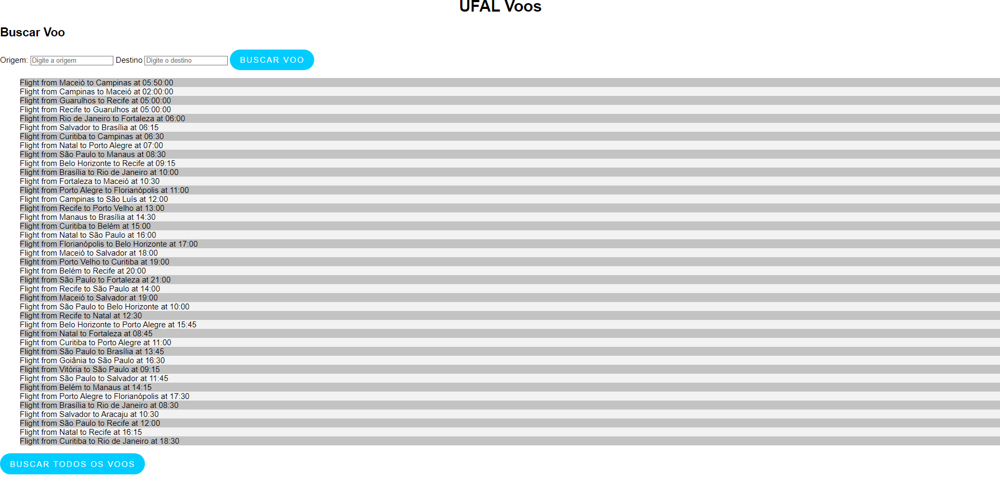

# Sistemas Distirbuídos - Web Service

Este projeto da disciplina de _Sistemas Distribuídos_ do curso de _Ciência da Computação_ pela _Universidade Federal de Alagoas - UFAL_ que consiste em uma aplicação cliente/servidor que tem como objetivo acessar um banco de dados com voos cadastrados e realizar a busca por todos os voos disponíveis e também por buscar voos com base na origem e destino buscador de voos.

- Professor: Tércio de Morais
- Alunos:
  - Adson Bruno
  - Vanessa Fernandes

## Requisitos

> Desenvolver uma aplicação cliente/servidor que simule uma busca de voos de uma empresa aérea
> Listar todos os voos que essa empresa possui
> Buscar por voos que tenham a origem e o destino
> Utilizar Web Service

## Aplicação: Buscador de voos

> Imagem mostrando o cliente da aplicação

  

